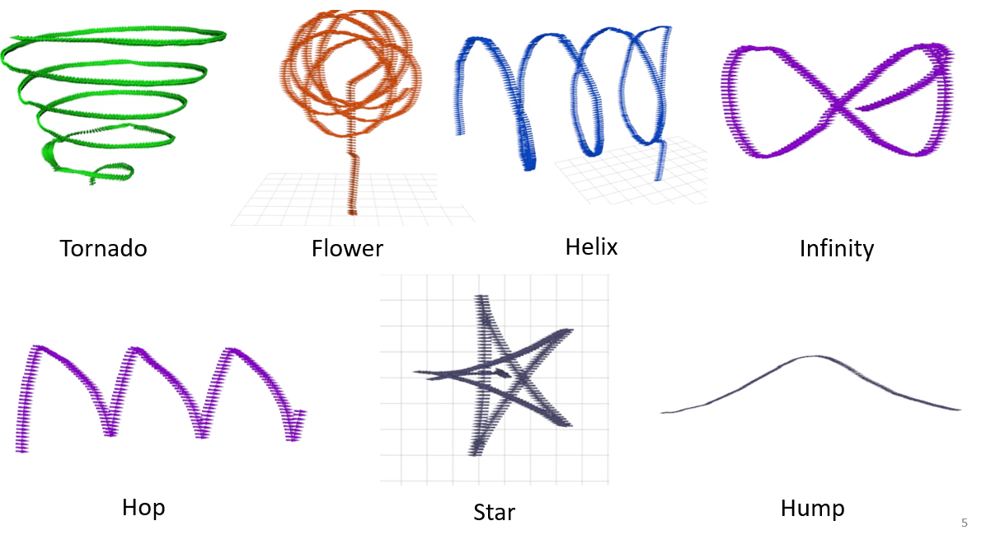

# ethz_polyhack
Repository for the drone hackathon: Polyhack

__Collaborators:__ [Mayank Mittal](https://github.com/Mayankm96), [Francesco Milano](https://github.com/francescomilano172), [Yasser Belal](https://github.com/yasserbelal)

## Trajector Generation Library



## Instructions to Setup

### PX4 and Gazebo

* Follow the instructions to install PX4 and Gazebo:
```bash
cd installation_scripts
./ubuntu_sim.sh
```
* After the installation is complete, log out and log back in. Check out the latest stable release:
```bash
cd ~/src/Firmware
git checkout v1.8.0
git submodule update
```
* Check that your setup works by compiling and running SITL:
```bash
make posix_sitl_default gazebo
```

### DronecodeSDK

* Create a folder and clone DronecodeSDK:
```
mkdir ~/projects
cd projects
git clone git clone https://github.com/Dronecode/DronecodeSDK.git
cd DronecodeSDK
```
* Checkout the release/branch you want to build:
```
git checkout master
```
* Update the submodules:
```
git submodule update --init --recursive
```
* Build the (debug) C++ library by calling:
```bash
make BUILD_TYPE=Release
sudo make default install  # sudo required to install files to system directories!

# First installation only
sudo ldconfig  # update linker cache
```

## Building the repository

* Follow these instructions to build
```bash
mkdir build && cd build
cmake ..
make
```
* To run the code:
```bash
./takeoff_and_land udp://:14540
```

## Visualization

* Install ROS and dependecy packages for PX4
* Launch the ROS node for interfacing with PX4 in SITL
```bash
roslaunch mavros px4.launch fcu_url:="udp://:14550@127.0.0.1:11345"
```
* Run rviz
```bash
rviz
```
